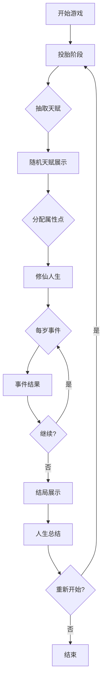
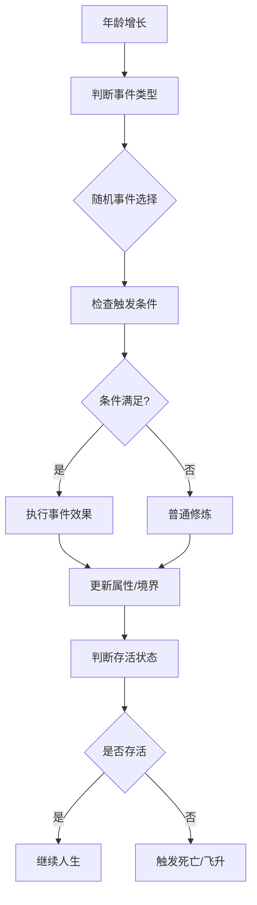

# 修仙人生重开模拟器 - 产品需求文档

## 1. 产品概述

一款以中国修仙文化为背景的文字模拟游戏，玩家将扮演一个修仙世界的凡人，通过随机天赋和属性，经历从炼气期到飞升的完整修仙人生。游戏充满随机性和戏剧性，每次重开都有不同的命运。

### 核心目标
- 模拟从凡人到仙人的修仙之路
- 提供类似抽卡的随机天赋系统
- 融合中国传统修仙文化元素
- 简洁但富有沉浸感的文字体验

### 目标用户
- 喜欢中国仙侠文化的玩家
- 喜欢随机性和Roguelike元素的玩家
- 喜欢文字冒险和模拟人生的玩家
- 修仙小说爱好者

---

## 2. 核心功能

### 2.1 角色创建系统

**天赋池系统**
- 稀有度分级：凡品、下品、中品、上品、极品、神话、传说
- 随机抽取一个初始天赋
- 天赋影响角色属性和特殊能力
- 天赋池包含 50+ 个不同天赋

**初始属性系统**
| 属性 | 范围 | 说明 |
|------|------|------|
| 根骨 | 1-10 | 影响修炼速度和突破成功率 |
| 悟性 | 1-10 | 影响功法领悟和技能学习 |
| 气运 | 1-10 | 影响奇遇和掉落概率 |
| 颜值 | 1-10 | 影响NPC互动和社交 |
| 家境 | 1-10 | 影响初始资源和发展起点 |
| 寿命 | 初始100 | 随着境界提升而增加 |

### 2.2 修仙境界系统

**修仙九大步境**
1. **炼气期** - 寿元：100年
2. **筑基期** - 寿元：200年
3. **金丹期** - 寿元：500年
4. **元婴期** - 寿元：1000年
5. **化神期** - 寿元：2000年
6. **炼虚期** - 寿元：5000年
7. **合体期** - 寿元：10000年
8. **大乘期** - 寿元：20000年
9. **渡劫期** - 渡劫成功飞升成仙，寿元无尽

### 2.3 随机事件系统

**事件类型**
- **修炼事件**：突破、顿悟、走火入魔
- **奇遇事件**：得到秘笈、遇到高人、发现遗迹
- **人际事件**：师徒、仇敌、挚友、道侣
- **劫难事件**：天劫、仇杀、疾病、心魔
- **日常事件**：坊市交易、宗门任务、闭关修炼

**事件判定机制**
- 基于属性（根骨、悟性、气运）的成功概率
- 基于当前境界的危险等级
- 随机性和策略性的平衡

### 2.4 核心游戏流程

```
开始游戏
  ↓
投胎（随机天赋 + 属性分配）
  ↓
修仙人生模拟（每年一个事件）
  ↓
死亡或飞升
  ↓
显示人生总结
  ↓
重新开始
```

**游戏结束条件**
- 寿元耗尽死亡
- 渡劫成功飞升
- 被仇敌杀死
- 走火入魔而亡

### 2.5 人生总结系统

**总结内容**
- 最终境界
- 存活年龄
- 人生经历统计（奇遇次数、战斗次数等）
- 成就徽章
- 人生评价（废柴、普通、强者、天骄、传奇、神话）

---

## 3. 核心流程

### 3.1 主流程图



### 3.2 事件触发流程



---

## 4. 用户界面设计

### 4.1 设计风格

**主题定位**
- 中国传统仙侠美学
- 古典水墨风格与现代UI结合
- 神秘、飘逸、古朴的视觉感受

**色彩方案**
- 主色：墨色 (#1a1a2e) - 神秘深邃
- 辅色：金色 (#d4af37) - 仙气高贵
- 点缀：青绿 (#2d5a4a) - 山水自然
- 背景：淡紫 (#f5f0ff) - 祥云瑞气
- 文字：白色/金色渐变

**字体选择**
- 标题：思源宋体或类似古典字体
- 正文：思源黑体或类似现代字体
- 特殊：书法风格用于境界名称

**布局风格**
- 垂直滚动式时间线
- 中央聚焦的信息卡片
- 两侧装饰性云纹/仙鹤图案
- 顶部悬浮状态栏

### 4.2 页面设计

**主页面结构**

| 模块 | 位置 | 功能描述 |
|------|------|---------|
| 状态栏 | 页面顶部 | 显示当前境界、年龄、寿命条 |
| 天赋展示 | 状态栏下方 | 显示当前天赋和属性 |
| 事件区域 | 页面中央 | 显示当前事件描述和选项 |
| 操作区 | 页面底部 | 确认/继续按钮 |
| 历史记录 | 侧边栏 | 人生经历时间线 |

**详细模块设计**

**1. 天赋抽取界面**
- 仙气缭绕的抽取动画
- 天赋卡片逐字显现
- 天赋名称、效果描述、稀有度标识
- 动画结束后显示天赋详情

**2. 修仙人生界面**
- 左侧：角色状态面板
  - 境界指示（圆形法阵样式）
  - 属性条（根骨、悟性、气运、颜值、家境）
  - 寿命条（进度条样式）
- 中央：事件描述区
  - 古风卷轴样式的文本框
  - 事件文字逐字显示效果
- 底部：操作按钮
  - "踏入修仙路" / "继续" / "飞升" 等

**3. 事件展示界面**
- 事件类型图标（如：📜 奇遇 / ⚔️ 战斗 / 🌟 顿悟）
- 事件标题
- 事件描述（带背景故事）
- 事件结果（带属性变化动画）

**4. 人生总结界面**
- 最终境界展示（大型境界图标）
- 人生评价标题（如：传奇修仙者）
- 数据统计面板
  - 存活年龄
  - 突破次数
  - 奇遇次数
  - 战斗胜利
  - 击杀敌人
- 成就徽章墙
- 重新开始按钮

### 4.3 响应式设计

**桌面端（1200px+）**
- 居中展示，最大宽度 800px
- 两侧添加装饰性云纹
- 更大的字体和间距

**平板端（768px-1199px）**
- 全宽展示，左右留白
- 简化装饰元素

**移动端（<768px）**
- 全屏沉浸式体验
- 触摸友好的大按钮
- 简化版UI，减少装饰

### 4.4 动画效果

**入场动画**
- 天赋卡片：从中心放大，带光晕效果
- 事件文字：逐字淡入，配合仙气粒子
- 境界突破：金光四射，全屏闪烁

**交互动画**
- 按钮悬停：轻微发光效果
- 属性变化：数值跳动动画
- 寿命减少：进度条渐变动画

**特殊效果**
- 飞升成功：金光大道、仙鹤飞舞
- 渡劫失败：天雷降临、黑云压顶
- 获得奇遇：彩虹光芒、仙音缭绕

---

## 5. 数据存储

### 5.1 本地存储
- 使用 LocalStorage 保存游戏记录
- 支持查看历史人生记录
- 记录最近 10 次游戏结果

### 5.2 数据结构
```typescript
interface GameRecord {
  id: string;
  date: string;
  finalRealm: string;
  age: number;
  talents: string[];
  stats: {
    根骨: number;
    悟性: number;
    气运: number;
    颜值: number;
    家境: number;
  };
  events: GameEvent[];
  result: 'died' | 'ascended';
}
```

---

## 6. 社交功能（可选）

- 生成分享卡片（图片格式）
- 分享到微信、微博等平台
- 排行榜（最高境界、最长寿命等）

---

## 7. 产品愿景

打造一款**沉浸感强、视觉精美、玩法有趣**的修仙文字冒险游戏。

**核心特色**
1. 🎲 **随机性**：每次都是全新人生
2. 📖 **故事性**：丰富的随机事件和奇遇
3. 🎨 **视觉美**：古典仙侠美学与现代UI结合
4. ⚡ **流畅性**：简洁操作，沉浸体验
5. 🔄 **重玩性**：多种结局，值得反复体验

**成功指标**
- 平均游戏时长：5-15分钟/局
- 重玩率：70%+ 用户会重开
- 分享率：30%+ 用户会分享
