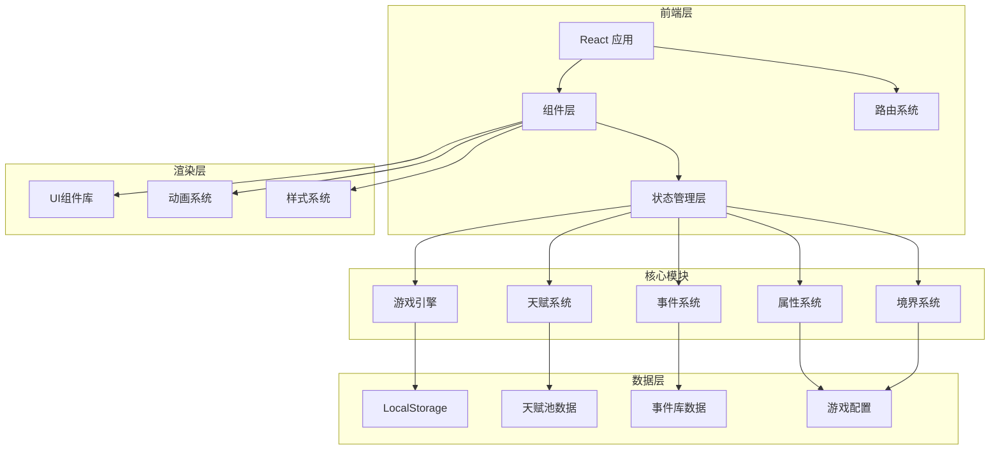

# 修仙人生重开模拟器 - 技术架构文档

## 1. 架构设计

### 1.1 系统架构图



### 1.2 技术栈选择

**前端框架**
- **React 18** + TypeScript
- 理由：组件化、状态管理、生态丰富

**构建工具**
- **Vite**
- 理由：极速启动、快速热更新

**样式方案**
- **Tailwind CSS**
- 理由：原子化CSS、高效开发、响应式友好

**状态管理**
- **Zustand**
- 理由：轻量级、简洁API、TypeScript支持好

**动画库**
- **Framer Motion**
- 理由：声明式动画、丰富交互效果

**路由系统**
- **React Router v6**
- 理由：官方推荐、 SPA支持好

**数据存储**
- **LocalStorage**
- 理由：无需后端、持久化存储

---

## 2. 项目结构

```
h:\TraeTest2
├── src/
│   ├── components/          # 通用组件
│   │   ├── ui/             # 基础UI组件
│   │   │   ├── Button.tsx
│   │   │   ├── Card.tsx
│   │   │   └── ProgressBar.tsx
│   │   ├── game/           # 游戏相关组件
│   │   │   ├── TalentCard.tsx
│   │   │   ├── StatusPanel.tsx
│   │   │   ├── EventDisplay.tsx
│   │   │   └── LifeSummary.tsx
│   │   └── layout/         # 布局组件
│   │       ├── GameLayout.tsx
│   │       └── Background.tsx
│   ├── pages/              # 页面
│   │   ├── Home.tsx       # 主页
│   │   ├── Game.tsx       # 游戏主界面
│   │   └── History.tsx    # 历史记录
│   ├── hooks/              # 自定义Hooks
│   │   ├── useGameEngine.ts
│   │   ├── useTalents.ts
│   │   ├── useEvents.ts
│   │   └── useLocalStorage.ts
│   ├── stores/             # Zustand状态库
│   │   └── gameStore.ts
│   ├── data/               # 静态数据
│   │   ├── talents.ts      # 天赋池
│   │   ├── events.ts       # 事件库
│   │   ├── realms.ts       # 境界配置
│   │   └── config.ts       # 游戏配置
│   ├── types/              # TypeScript类型
│   │   └── index.ts
│   ├── utils/              # 工具函数
│   │   ├── random.ts
│   │   └── storage.ts
│   ├── styles/             # 全局样式
│   │   └── globals.css
│   ├── App.tsx
│   └── main.tsx
├── public/
├── index.html
├── package.json
├── tsconfig.json
├── vite.config.ts
└── tailwind.config.js
```

---

## 3. 核心数据模型

### 3.1 类型定义

```typescript
// src/types/index.ts

// 天赋
export interface Talent {
  id: string;
  name: string;
  description: string;
  rarity: '凡品' | '下品' | '中品' | '上品' | '极品' | '神话' | '传说';
  effect: {
    根骨?: number;
    悟性?: number;
    气运?: number;
    颜值?: number;
    家境?: number;
  };
  probability: number; // 抽取概率
}

// 境界
export interface Realm {
  name: string;
  level: number;
  maxAge: number;
  description: string;
  requirements: {
    minAge: number;
    attributes: {
      根骨?: number;
      悟性?: number;
      气运?: number;
    };
  };
}

// 角色属性
export interface Attributes {
  根骨: number;
  悟性: number;
  气运: number;
  颜值: number;
  家境: number;
}

// 游戏状态
export interface GameState {
  status: 'idle' | 'creating' | 'playing' | 'ended';
  age: number;
  currentRealm: Realm;
  attributes: Attributes;
  talent: Talent | null;
  lifespan: number;
  events: GameEvent[];
  achievements: string[];
}

// 游戏事件
export interface GameEvent {
  id: string;
  age: number;
  type: 'cultivation' | 'encounter' | 'social' | 'disaster' | 'daily';
  title: string;
  description: string;
  effects: {
    根骨?: number;
    悟性?: number;
    气运?: number;
    颜值?: number;
    家境?: number;
    寿命?: number;
    境界?: 'advance' | 'regress';
  };
  result: 'success' | 'failure' | 'neutral';
  isEnding?: boolean;
  endingType?: 'died' | 'ascended';
}

// 游戏记录
export interface GameRecord {
  id: string;
  date: string;
  finalRealm: string;
  age: number;
  talent: string;
  result: 'died' | 'ascended';
  stats: Attributes;
  achievements: string[];
}
```

### 3.2 天赋池数据

```typescript
// src/data/talents.ts

export const talents: Talent[] = [
  // 凡品 (40%)
  {
    id: 'normal-1',
    name: '平凡之资',
    description: '普普通通的修仙资质，没有任何特殊之处',
    rarity: '凡品',
    effect: {},
    probability: 0.15
  },
  // 下品 (25%)
  {
    id: 'low-1',
    name: '微弱灵根',
    description: '只有微弱的灵根，勉强可以感应灵气',
    rarity: '下品',
    effect: { 根骨: 1 },
    probability: 0.12
  },
  // 中品 (15%)
  {
    id: 'medium-1',
    name: '普通灵根',
    description: '中规中矩的灵根资质，修炼速度一般',
    rarity: '中品',
    effect: { 根骨: 2, 悟性: 1 },
    probability: 0.08
  },
  {
    id: 'medium-2',
    name: '书香门第',
    description: '出身于读书人家，自幼聪慧',
    rarity: '中品',
    effect: { 悟性: 3, 家境: 2 },
    probability: 0.07
  },
  // 上品 (10%)
  {
    id: 'high-1',
    name: '上佳灵根',
    description: '优秀的灵根资质，修炼速度较快',
    rarity: '上品',
    effect: { 根骨: 3, 悟性: 2 },
    probability: 0.05
  },
  {
    id: 'high-2',
    name: '天命之人',
    description: '天生受到天道眷顾，气运加身',
    rarity: '上品',
    effect: { 气运: 5 },
    probability: 0.05
  },
  // 极品 (7%)
  {
    id: 'rare-1',
    name: '天生剑体',
    description: '天生与剑意相通，剑道天赋绝伦',
    rarity: '极品',
    effect: { 根骨: 4, 悟性: 3, 气运: 2 },
    probability: 0.03
  },
  {
    id: 'rare-2',
    name: '仙门嫡传',
    description: '出生于修仙大族的嫡系血脉',
    rarity: '极品',
    effect: { 家境: 5, 根骨: 2, 气运: 2 },
    probability: 0.04
  },
  // 神话 (2%)
  {
    id: 'mythical-1',
    name: '混沌灵根',
    description: '传说中可容纳万物的混沌灵根',
    rarity: '神话',
    effect: { 根骨: 5, 悟性: 5, 气运: 5 },
    probability: 0.01
  },
  {
    id: 'mythical-2',
    name: '重瞳者',
    description: '天生重瞳，可看透世间一切虚妄',
    rarity: '神话',
    effect: { 悟性: 8, 气运: 3 },
    probability: 0.01
  },
  // 传说 (1%)
  {
    id: 'legendary-1',
    name: '转世仙人',
    description: '上一世陨落的仙人转世重生',
    rarity: '传说',
    effect: { 根骨: 8, 悟性: 8, 气运: 8 },
    probability: 0.005
  },
  {
    id: 'legendary-2',
    name: '天命主角',
    description: '天道眷顾的主角模板，气运无双',
    rarity: '传说',
    effect: { 根骨: 10, 悟性: 10, 气运: 10, 颜值: 10, 家境: 10 },
    probability: 0.005
  }
];
```

### 3.3 境界数据

```typescript
// src/data/realms.ts

export const realms: Realm[] = [
  {
    name: '炼气期',
    level: 1,
    maxAge: 100,
    description: '吸纳天地灵气，铸就修仙根基',
    requirements: {
      minAge: 0,
      attributes: { 根骨: 1 }
    }
  },
  {
    name: '筑基期',
    level: 2,
    maxAge: 200,
    description: '筑就仙道基础，丹田中结成气旋',
    requirements: {
      minAge: 20,
      attributes: { 根骨: 3, 悟性: 2 }
    }
  },
  {
    name: '金丹期',
    level: 3,
    maxAge: 500,
    description: '丹成金色，一颗金丹吞入腹',
    requirements: {
      minAge: 50,
      attributes: { 根骨: 5, 悟性: 4 }
    }
  },
  {
    name: '元婴期',
    level: 4,
    maxAge: 1000,
    description: '金莲中孕育元婴，神魂出窍',
    requirements: {
      minAge: 100,
      attributes: { 根骨: 7, 悟性: 6 }
    }
  },
  {
    name: '化神期',
    level: 5,
    maxAge: 2000,
    description: '元婴化为神魂，神识覆盖万里',
    requirements: {
      minAge: 200,
      attributes: { 根骨: 8, 悟性: 7, 气运: 5 }
    }
  },
  {
    name: '炼虚期',
    level: 6,
    maxAge: 5000,
    description: '炼化虚妄，身化天地',
    requirements: {
      minAge: 400,
      attributes: { 根骨: 9, 悟性: 8, 气运: 6 }
    }
  },
  {
    name: '合体期',
    level: 7,
    maxAge: 10000,
    description: '神魂与肉身合一，举手投足皆合天道',
    requirements: {
      minAge: 800,
      attributes: { 根骨: 9, 悟性: 9, 气运: 8 }
    }
  },
  {
    name: '大乘期',
    level: 8,
    maxAge: 20000,
    description: '功德圆满，只待飞升',
    requirements: {
      minAge: 1500,
      attributes: { 根骨: 10, 悟性: 10, 气运: 9 }
    }
  },
  {
    name: '渡劫期',
    level: 9,
    maxAge: Infinity,
    description: '承受天劫考验，成功则飞升成仙',
    requirements: {
      minAge: 3000,
      attributes: { 根骨: 10, 悟性: 10, 气运: 10 }
    }
  }
];
```

### 3.4 事件库数据

```typescript
// src/data/events.ts

export const events: GameEvent[] = [
  // 修炼事件
  {
    id: 'cultivation-breakthrough',
    age: 0,
    type: 'cultivation',
    title: '境界突破',
    description: '凭借惊人的天赋，你成功突破到下一个境界！',
    effects: { 境界: 'advance' },
    result: 'success'
  },
  {
    id: 'cultivation-failure',
    age: 0,
    type: 'cultivation',
    title: '修炼受阻',
    description: '修炼过程中遇到瓶颈，进境缓慢',
    effects: { 悟性: -1 },
    result: 'failure'
  },
  
  // 奇遇事件
  {
    id: 'encounter-secret-manual',
    age: 0,
    type: 'encounter',
    title: '得到秘笈',
    description: '在山洞中偶然发现一本古老功法秘籍',
    effects: { 悟性: 2, 气运: 1 },
    result: 'success'
  },
  {
    id: 'encounter-master',
    age: 0,
    type: 'encounter',
    title: '拜师学艺',
    description: '遇到一位高人，愿意收你为徒',
    effects: { 根骨: 2, 家境: 1 },
    result: 'success'
  },
  {
    id: 'encounter-treasure',
    age: 0,
    type: 'encounter',
    title: '发现遗迹',
    description: '探索古修士遗迹，获得珍贵宝物',
    effects: { 气运: 3, 家境: 2 },
    result: 'success'
  },
  
  // 人际事件
  {
    id: 'social-rival',
    age: 0,
    type: 'social',
    title: '结下仇怨',
    description: '与人发生冲突，结下不解之仇',
    effects: { 气运: -2 },
    result: 'failure'
  },
  {
    id: 'social-partner',
    age: 0,
    type: 'social',
    title: '遇见道侣',
    description: '修仙路上遇到志同道合之人',
    effects: { 气运: 2, 颜值: 1 },
    result: 'success'
  },
  
  // 劫难事件
  {
    id: 'disaster-accident',
    age: 0,
    type: 'disaster',
    title: '遭遇意外',
    description: '遭遇妖兽袭击，身受重伤',
    effects: { 寿命: -10, 根骨: -1 },
    result: 'failure'
  },
  {
    id: 'disaster-plague',
    age: 0,
    type: 'disaster',
    title: '身染重病',
    description: '修炼过度导致走火入魔',
    effects: { 寿命: -20, 悟性: -2 },
    result: 'failure'
  },
  
  // 日常事件
  {
    id: 'daily-merchant',
    age: 0,
    type: 'daily',
    title: '坊市淘宝',
    description: '在修仙坊市淘到好东西',
    effects: { 家境: 1, 气运: 1 },
    result: 'success'
  },
  {
    id: 'daily-meditation',
    age: 0,
    type: 'daily',
    title: '闭关修炼',
    description: '安心闭关，修为稳步提升',
    effects: { 根骨: 1, 悟性: 1 },
    result: 'success'
  }
];
```

---

## 4. 游戏引擎核心逻辑

### 4.1 核心算法

```typescript
// src/hooks/useGameEngine.ts

import { create } from 'zustand';
import { talents } from '@/data/talents';
import { realms } from '@/data/realms';
import { events } from '@/data/events';
import type { GameState, Talent, Realm, GameEvent } from '@/types';
import { randomSelect, randomInt } from '@/utils/random';

export const useGameStore = create<{
  // 状态
  gameState: GameState;
  
  // 动作
  startNewGame: () => void;
  drawTalent: () => Talent;
  advanceAge: () => void;
  processEvent: () => void;
  checkRealmAdvancement: () => boolean;
  checkGameEnd: () => boolean;
  endGame: (result: 'died' | 'ascended') => void;
  saveGame: () => void;
}>((set, get) => ({
  gameState: {
    status: 'idle',
    age: 0,
    currentRealm: realms[0],
    attributes: {
      根骨: 5,
      悟性: 5,
      气运: 5,
      颜值: 5,
      家境: 5
    },
    talent: null,
    lifespan: 100,
    events: [],
    achievements: []
  },
  
  // 开始新游戏
  startNewGame: () => {
    const talent = get().drawTalent();
    const initialAttributes = {
      根骨: 5 + (talent.effect.根骨 || 0),
      悟性: 5 + (talent.effect.悟性 || 0),
      气运: 5 + (talent.effect.气运 || 0),
      颜值: 5 + (talent.effect.颜值 || 0),
      家境: 5 + (talent.effect.家境 || 0)
    };
    
    set({
      gameState: {
        status: 'playing',
        age: 0,
        currentRealm: realms[0],
        attributes: initialAttributes,
        talent,
        lifespan: 100,
        events: [],
        achievements: []
      }
    });
  },
  
  // 抽取天赋
  drawTalent: () => {
    const totalProbability = talents.reduce((sum, t) => sum + t.probability, 0);
    let random = Math.random() * totalProbability;
    
    for (const talent of talents) {
      random -= talent.probability;
      if (random <= 0) {
        return talent;
      }
    }
    
    return talents[0]; // 默认返回凡品天赋
  },
  
  // 年龄推进
  advanceAge: () => {
    const { gameState } = get();
    const newAge = gameState.age + 1;
    
    // 检查是否超过寿命
    if (newAge >= gameState.lifespan) {
      get().endGame('died');
      return;
    }
    
    set({
      gameState: {
        ...gameState,
        age: newAge
      }
    });
    
    // 处理事件
    get().processEvent();
  },
  
  // 处理随机事件
  processEvent: () => {
    const { gameState } = get();
    const { age, currentRealm, attributes } = gameState;
    
    // 随机选择一个事件
    const event = randomSelect(events);
    
    // 计算成功率
    const successRate = calculateEventSuccessRate(event, attributes);
    const isSuccess = Math.random() < successRate;
    
    // 应用事件效果
    const newEvent: GameEvent = {
      ...event,
      age,
      result: isSuccess ? 'success' : 'failure'
    };
    
    const newAttributes = { ...attributes };
    const effects = isSuccess ? event.effects : applyFailureEffects(event);
    
    // 应用属性变化
    Object.keys(effects).forEach(key => {
      if (key in newAttributes && key !== '境界') {
        newAttributes[key as keyof typeof attributes] += effects[key] as number;
        // 确保属性在 1-10 范围内
        newAttributes[key as keyof typeof attributes] = Math.max(1, Math.min(10, newAttributes[key as keyof typeof attributes]));
      }
    });
    
    // 更新境界
    let newRealm = currentRealm;
    let newLifespan = gameState.lifespan;
    
    if (effects.境界 === 'advance') {
      const nextRealmIndex = realms.findIndex(r => r.name === currentRealm.name) + 1;
      if (nextRealmIndex < realms.length) {
        newRealm = realms[nextRealmIndex];
        newLifespan = newRealm.maxAge;
      }
    }
    
    set({
      gameState: {
        ...gameState,
        age,
        attributes: newAttributes,
        currentRealm: newRealm,
        lifespan: newLifespan,
        events: [...gameState.events, newEvent]
      }
    });
    
    // 检查游戏结束
    get().checkGameEnd();
  },
  
  // 检查境界突破
  checkRealmAdvancement: () => {
    const { gameState } = get();
    const { currentRealm, attributes, age } = gameState;
    
    const realmIndex = realms.findIndex(r => r.name === currentRealm.name);
    if (realmIndex >= realms.length - 1) return false;
    
    const nextRealm = realms[realmIndex + 1];
    const requirements = nextRealm.requirements;
    
    // 检查年龄和属性要求
    if (age < requirements.minAge) return false;
    
    let meetsRequirements = true;
    if (requirements.attributes.根骨 && attributes.根骨 < requirements.attributes.根骨) {
      meetsRequirements = false;
    }
    if (requirements.attributes.悟性 && attributes.悟性 < requirements.attributes.悟性) {
      meetsRequirements = false;
    }
    if (requirements.attributes.气运 && attributes.气运 < requirements.attributes.气运) {
      meetsRequirements = false;
    }
    
    return meetsRequirements;
  },
  
  // 检查游戏结束
  checkGameEnd: () => {
    const { gameState } = get();
    
    // 检查寿命
    if (gameState.age >= gameState.lifespan) {
      get().endGame('died');
      return;
    }
    
    // 检查是否飞升
    if (gameState.currentRealm.name === '渡劫期' && gameState.age >= 5000) {
      get().endGame('ascended');
    }
  },
  
  // 结束游戏
  endGame: (result) => {
    set({
      gameState: {
        ...get().gameState,
        status: 'ended'
      }
    });
    get().saveGame();
  },
  
  // 保存游戏记录
  saveGame: () => {
    const { gameState } = get();
    const record: GameRecord = {
      id: Date.now().toString(),
      date: new Date().toISOString(),
      finalRealm: gameState.currentRealm.name,
      age: gameState.age,
      talent: gameState.talent?.name || '',
      result: gameState.status === 'ascended' ? 'ascended' : 'died',
      stats: gameState.attributes,
      achievements: gameState.achievements
    };
    
    const records = getStoredRecords();
    records.unshift(record);
    localStorage.setItem('gameRecords', JSON.stringify(records.slice(0, 10)));
  }
}));

// 计算事件成功率
function calculateEventSuccessRate(event: GameEvent, attributes: Attributes): number {
  let baseRate = 0.5;
  
  switch (event.type) {
    case 'cultivation':
      baseRate = 0.3 + (attributes.根骨 * 0.05) + (attributes.悟性 * 0.05);
      break;
    case 'encounter':
      baseRate = 0.4 + (attributes.气运 * 0.06);
      break;
    case 'social':
      baseRate = 0.5 + (attributes.颜值 * 0.05);
      break;
    case 'disaster':
      baseRate = 0.6 - (attributes.根骨 * 0.05);
      break;
    case 'daily':
      baseRate = 0.7 + (attributes.悟性 * 0.03);
      break;
  }
  
  return Math.max(0.1, Math.min(0.95, baseRate));
}

// 应用失败效果
function applyFailureEffects(event: GameEvent): any {
  const failureEffects: any = {};
  
  if (event.effects.根骨) failureEffects.根骨 = Math.floor(event.effects.根骨 / 2);
  if (event.effects.悟性) failureEffects.悟性 = Math.floor(event.effects.悟性 / 2);
  if (event.effects.气运) failureEffects.气运 = Math.floor(event.effects.气运 / 2);
  if (event.effects.颜值) failureEffects.颜值 = Math.floor(event.effects.颜值 / 2);
  if (event.effects.家境) failureEffects.家境 = Math.floor(event.effects.家境 / 2);
  if (event.effects.寿命) failureEffects.寿命 = event.effects.寿命;
  
  return failureEffects;
}

// 从本地存储获取记录
function getStoredRecords(): GameRecord[] {
  const stored = localStorage.getItem('gameRecords');
  return stored ? JSON.parse(stored) : [];
}
```

---

## 5. 路由设计

```typescript
// src/App.tsx
import { BrowserRouter, Routes, Route } from 'react-router-dom';
import Home from '@/pages/Home';
import Game from '@/pages/Game';
import History from '@/pages/History';

function App() {
  return (
    <BrowserRouter>
      <Routes>
        <Route path="/" element={<Home />} />
        <Route path="/game" element={<Game />} />
        <Route path="/history" element={<History />} />
      </Routes>
    </BrowserRouter>
  );
}
```

### 路由定义

| 路径 | 页面 | 功能 |
|------|------|------|
| / | Home | 主页：开始游戏入口 |
| /game | Game | 游戏主界面 |
| /history | History | 历史记录查看 |

---

## 6. 组件设计

### 6.1 组件结构

```typescript
// 主要组件

// 页面组件
- Home.tsx: 主页组件
- Game.tsx: 游戏主界面
- History.tsx: 历史记录页面

// 游戏组件
- TalentDraw: 天赋抽取动画组件
- StatusPanel: 状态面板组件
- EventDisplay: 事件展示组件
- AttributeBar: 属性条组件
- RealmBadge: 境界徽章组件
- LifeTimeline: 人生时间线组件
- LifeSummary: 人生总结组件
- GameOverModal: 游戏结束弹窗

// UI基础组件
- Button: 按钮组件
- Card: 卡片组件
- ProgressBar: 进度条组件
- Modal: 弹窗组件
```

### 6.2 关键组件实现

#### TalentDraw 组件
```typescript
// src/components/game/TalentDraw.tsx
import { motion, AnimatePresence } from 'framer-motion';
import { useGameStore } from '@/stores/gameStore';

export default function TalentDraw() {
  const { drawTalent, startNewGame, gameState } = useGameStore();
  const [showTalent, setShowTalent] = useState(false);
  const [currentTalent, setCurrentTalent] = useState<Talent | null>(null);
  
  const handleDraw = () => {
    const talent = drawTalent();
    setCurrentTalent(talent);
    setShowTalent(true);
  };
  
  const handleConfirm = () => {
    setShowTalent(false);
    startNewGame();
  };
  
  return (
    <div className="flex flex-col items-center">
      <AnimatePresence>
        {!showTalent ? (
          <motion.button
            initial={{ scale: 1 }}
            animate={{ scale: [1, 1.1, 1] }}
            transition={{ duration: 2, repeat: Infinity }}
            onClick={handleDraw}
            className="px-8 py-4 bg-gradient-to-r from-purple-600 to-pink-600 text-white rounded-full text-xl font-bold shadow-lg hover:shadow-2xl"
          >
            🎲 投胎转世
          </motion.button>
        ) : (
          <motion.div
            initial={{ scale: 0, rotate: -180 }}
            animate={{ scale: 1, rotate: 0 }}
            className="bg-gradient-to-br from-yellow-900 to-yellow-700 p-8 rounded-xl shadow-2xl"
          >
            <div className="text-center">
              <div className="text-6xl mb-4">✨</div>
              <h2 className="text-3xl font-bold text-yellow-100 mb-4">
                {currentTalent?.name}
              </h2>
              <p className="text-yellow-200 mb-2">
                稀有度: {currentTalent?.rarity}
              </p>
              <p className="text-yellow-300 mb-6">
                {currentTalent?.description}
              </p>
              <button
                onClick={handleConfirm}
                className="px-6 py-3 bg-yellow-500 text-gray-900 rounded-lg font-bold hover:bg-yellow-400 transition-colors"
              >
                踏入修仙路 🚀
              </button>
            </div>
          </motion.div>
        )}
      </AnimatePresence>
    </div>
  );
}
```

#### StatusPanel 组件
```typescript
// src/components/game/StatusPanel.tsx
import { motion } from 'framer-motion';
import { useGameStore } from '@/stores/gameStore';

export default function StatusPanel() {
  const { gameState } = useGameStore();
  const { currentRealm, age, lifespan, attributes, talent } = gameState;
  
  const lifespanPercent = (age / lifespan) * 100;
  
  return (
    <div className="bg-gray-900/80 backdrop-blur-sm rounded-xl p-6 space-y-4">
      {/* 境界显示 */}
      <div className="text-center mb-6">
        <div className="text-sm text-purple-300 mb-2">当前境界</div>
        <motion.div
          key={currentRealm.name}
          initial={{ scale: 0.8, opacity: 0 }}
          animate={{ scale: 1, opacity: 1 }}
          className="text-4xl font-bold bg-gradient-to-r from-purple-400 to-pink-400 bg-clip-text text-transparent"
        >
          {currentRealm.name}
        </motion.div>
      </div>
      
      {/* 天赋显示 */}
      {talent && (
        <div className="text-center border-b border-purple-800 pb-4">
          <div className="text-xs text-gray-400">天赋</div>
          <div className="text-lg text-yellow-400 font-semibold">{talent.name}</div>
        </div>
      )}
      
      {/* 年龄和寿命 */}
      <div className="space-y-2">
        <div className="flex justify-between text-sm">
          <span className="text-gray-300">年龄</span>
          <span className="text-white font-semibold">{age} 岁</span>
        </div>
        <div className="relative h-2 bg-gray-700 rounded-full overflow-hidden">
          <motion.div
            initial={{ width: 0 }}
            animate={{ width: `${lifespanPercent}%` }}
            className="absolute inset-y-0 left-0 bg-gradient-to-r from-green-500 to-red-500"
          />
        </div>
        <div className="text-xs text-gray-500 text-right">
          寿命: {lifespan === Infinity ? '无尽' : `${lifespan} 年`}
        </div>
      </div>
      
      {/* 属性条 */}
      <div className="grid grid-cols-2 gap-3">
        {Object.entries(attributes).map(([key, value]) => (
          <AttributeBar key={key} name={key} value={value} />
        ))}
      </div>
    </div>
  );
}

function AttributeBar({ name, value }: { name: string; value: number }) {
  return (
    <div className="space-y-1">
      <div className="flex justify-between text-xs">
        <span className="text-gray-400">{name}</span>
        <span className="text-white font-semibold">{value}</span>
      </div>
      <div className="relative h-1.5 bg-gray-700 rounded-full overflow-hidden">
        <motion.div
          initial={{ width: 0 }}
          animate={{ width: `${value * 10}%` }}
          transition={{ duration: 0.5, ease: 'easeOut' }}
          className="absolute inset-y-0 left-0 bg-gradient-to-r from-blue-500 to-cyan-400"
        />
      </div>
    </div>
  );
}
```

---

## 7. 样式设计

### 7.1 Tailwind配置

```javascript
// tailwind.config.js
export default {
  content: [
    "./index.html",
    "./src/**/*.{js,ts,jsx,tsx}",
  ],
  theme: {
    extend: {
      colors: {
        'xuan-primary': '#1a1a2e',      // 墨色
        'xuan-gold': '#d4af37',         // 金色
        'xuan-green': '#2d5a4a',        // 青绿
        'xuan-bg': '#f5f0ff',           // 淡紫
      },
      fontFamily: {
        'song': ['SimSun', 'serif'],     // 宋体
        'hei': ['Microsoft YaHei', 'sans-serif'], // 黑体
      },
      animation: {
        'float': 'float 3s ease-in-out infinite',
        'glow': 'glow 2s ease-in-out infinite alternate',
      },
      keyframes: {
        float: {
          '0%, 100%': { transform: 'translateY(0)' },
          '50%': { transform: 'translateY(-10px)' },
        },
        glow: {
          '0%': { boxShadow: '0 0 5px rgba(212, 175, 55, 0.5)' },
          '100%': { boxShadow: '0 0 20px rgba(212, 175, 55, 0.8)' },
        },
      },
    },
  },
  plugins: [],
}
```

### 7.2 全局样式

```css
/* src/styles/globals.css */
@import url('https://fonts.googleapis.com/css2?family=Noto+Serif+SC:wght@400;700&display=swap');

@tailwind base;
@tailwind components;
@tailwind utilities;

body {
  @apply bg-gradient-to-br from-xuan-primary via-purple-900 to-xuan-primary text-white;
  font-family: 'Noto Serif SC', 'SimSun', serif;
}

/* 仙气粒子效果 */
.xuan-particle {
  @apply absolute w-2 h-2 bg-white rounded-full opacity-50;
  animation: float-particle 8s ease-in-out infinite;
}

@keyframes float-particle {
  0%, 100% {
    transform: translateY(0) translateX(0);
    opacity: 0;
  }
  10% {
    opacity: 0.8;
  }
  90% {
    opacity: 0.8;
  }
  100% {
    transform: translateY(-100vh) translateX(20px);
    opacity: 0;
  }
}

/* 卷轴样式 */
.scroll-container {
  @apply relative bg-gradient-to-b from-yellow-100 to-yellow-200 text-gray-900 rounded-lg p-6 shadow-xl;
  background-image: 
    linear-gradient(to bottom, transparent 0%, rgba(255,255,255,0.3) 50%, transparent 100%),
    url("data:image/svg+xml,%3Csvg width='100' height='100' viewBox='0 0 100 100' xmlns='http://www.w3.org/2000/svg'%3E%3Cpath d='M11 18c3.866 0 7-3.134 7-7s-3.134-7-7-7-7 3.134-7 7 3.134 7 7 7zm48 25c3.866 0 7-3.134 7-7s-3.134-7-7-7-7 3.134-7 7 3.134 7 7 7zm-43-7c1.657 0 3-1.343 3-3s-1.343-3-3-3-3 1.343-3 3 1.343 3 3 3zm63 31c1.657 0 3-1.343 3-3s-1.343-3-3-3-3 1.343-3 3 1.343 3 3 3zM34 90c1.657 0 3-1.343 3-3s-1.343-3-3-3-3 1.343-3 3 1.343 3 3 3zm56-76c1.657 0 3-1.343 3-3s-1.343-3-3-3-3 1.343-3 3 1.343 3 3 3zM12 86c2.21 0 4-1.79 4-4s-1.79-4-4-4-4 1.79-4 4 1.79 4 4 4zm28-65c2.21 0 4-1.79 4-4s-1.79-4-4-4-4 1.79-4 4 1.79 4 4 4zm23-11c2.76 0 5-2.24 5-5s-2.24-5-5-5-5 2.24-5 5 2.24 5 5 5zm-6 60c2.21 0 4-1.79 4-4s-1.79-4-4-4-4 1.79-4 4 1.79 4 4 4zm29 22c2.76 0 5-2.24 5-5s-2.24-5-5-5-5 2.24-5 5 2.24 5 5 5zM32 63c2.76 0 5-2.24 5-5s-2.24-5-5-5-5 2.24-5 5 2.24 5 5 5zm57-13c2.76 0 5-2.24 5-5s-2.24-5-5-5-5 2.24-5 5 2.24 5 5 5zm-9-21c1.105 0 2-.895 2-2s-.895-2-2-2-2 .895-2 2 .895 2 2 2zM60 91c1.105 0 2-.895 2-2s-.895-2-2-2-2 .895-2 2 .895 2 2 2zM35 41c1.105 0 2-.895 2-2s-.895-2-2-2-2 .895-2 2 .895 2 2 2z' fill='%23d4af37' fill-opacity='0.05' fill-rule='evenodd'/%3E%3C/svg%3E");
}
```

---

## 8. 性能优化

### 8.1 代码分割
- 使用 React.lazy 进行路由级别的代码分割
- 动画库按需加载

### 8.2 渲染优化
- 使用 React.memo 优化组件重渲染
- 使用 useMemo 和 useCallback 缓存计算结果
- 事件列表使用虚拟滚动（如果列表过长）

### 8.3 动画性能
- 使用 CSS transform 和 opacity 进行动画
- 避免布局抖动（layout thrashing）
- 使用 will-change 提示浏览器优化

---

## 9. 测试策略

### 9.1 单元测试
- 使用 Vitest 进行单元测试
- 测试游戏引擎核心逻辑
- 测试随机数生成和事件判定

### 9.2 集成测试
- 测试组件交互
- 测试游戏流程完整性

### 9.3 E2E测试（可选）
- 使用 Playwright 进行端到端测试
- 测试完整游戏流程

---

## 10. 部署方案

### 10.1 构建
```bash
# 开发构建
npm run dev

# 生产构建
npm run build
```

### 10.2 部署目标
- **Vercel**: 静态网站部署（推荐）
- **Netlify**: 静态网站部署
- **GitHub Pages**: 免费部署

### 10.3 域名配置
- 可选配置自定义域名
- 支持 HTTPS 自动证书

---

## 11. 开发计划

### Phase 1: 核心系统 (1-2天)
- 项目初始化
- 数据模型定义
- 天赋和事件系统实现
- 游戏引擎核心逻辑

### Phase 2: UI界面 (2-3天)
- 主页设计
- 游戏界面开发
- 动画效果实现
- 响应式适配

### Phase 3: 功能完善 (1-2天)
- 历史记录功能
- 社交分享功能
- 数据持久化

### Phase 4: 测试优化 (1天)
- 性能优化
- Bug修复
- 用户体验优化
